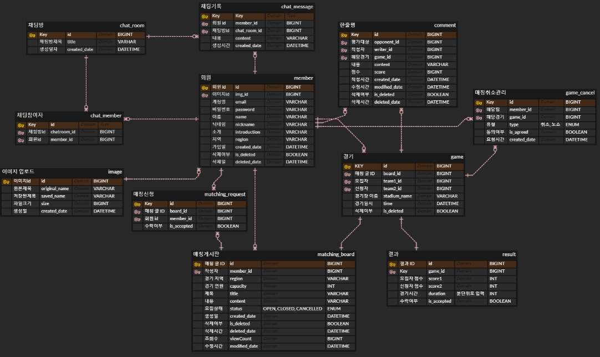

## Overview

> ❓ 우리 팀과 함께 축구 경기를 할 상대 팀을 쉽게 구할 순 없을까?
 &nbsp;&nbsp;&nbsp;&nbsp;&nbsp;&nbsp;
일정이 맞는 다양한 팀들과 함께 경기해 보고 싶다...

>💡 경기 매칭을 도와주는 플랫폼을 만들어보자!

## 📖 Introduction

### 🛠️ Project Architecture

 

### 🛠️ Backend Tech Stack
- Framework: `SpringBoot`, `SpringSecurity`, `SpringDataJPA`
- Language: `JAVA 17`
- Login: `JWT`
- Database: `AWS RDS(MySQL)`, `AWS Elasticache(Redis)`, `AWS S3`
- Deploy: `AWS EC2`
- CI/CD: `Github Actions`
- Communication Tools : `Notion`, `Gather`, `Slack`

 

### 💻 주요 기능
---
🔑  **계정**
<table>
  <tr>
    <td rowspan="6" max-width="500px">
        <video src="https://github.com/matching-goal/backend/assets/132976212/75015ba7-6fb8-427e-9748-895a66556e0d"/> 회원가입 or 로그인 사진
    </td>
    <td>
      회원가입
    </td>
    <td>
      - 메일인증 필수  - 닉네임 중복x 
    </td>
  </tr>

  <tr>
      <td>회원 탈퇴</td>
      <td>- 탈퇴한 유저는 재가입 가능</td>
  </tr>

  <tr>
    <td>
      로그인 
    </td>
    <td>
      - 이메일, 비밀번호 입력
    </td>
  </tr>

  <tr>
      <td>로그아웃</td>
      <td>
      - 로그아웃후, 이전 토큰으로 로그인 x </td>
  </tr>

  <tr>
      <td>비밀번호 재설정</td>
      <td>- 비밀번호 분실/변경 -> 재설정 가능 
      - 동일 비밀번호로 변경 불가능 </td>
  </tr>

  <tr>
      <td>회원 정보 수정</td>
      <td>- 프로필 이미지, 닉네임, 소개 수정 가능  
      - 닉네임 중복x</td>
  </tr>
</table>
 

📌  **회원 프로필**
<table>
  <tr>
    <td rowspan="7" max-width="500px">
        <video src="https://github.com/matching-goal/backend/assets/132976212/59245169-e4fa-4a51-b4a2-94e370d1634d"/>프로필 조회사진
    </td>
    <td>
      프로필 조회
    </td>
    <td>
      - (이메일, 이름, 닉네임(팀이름), 소개, 지역, 프로필 이미지, 가입일) 조회 가능 
    </td>
  </tr>

  <tr>
    <td>
      다른 회원 프로필 조회 
    </td>
    <td>
      - (닉네임, 소개, 지역, 프로필이미지) 조회 가능 
    </td>
  </tr>

  <tr>
    <td>
      회원 일정 조회 
    </td>
    <td>
      - 특정 월의 일정 조회  
      - 상대방이 확정된 게임만 조회 가능
    </td>
  </tr>

  <tr>
    <td>
      경기 기록 
    </td>
    <td>
      - 참여했던 경기 기록 확인  
      - (상대편, 경기일시, 점수)등 확인 가능
    </td>
  </tr>

  <tr>
    <td>
      전적 조회 
    </td>
    <td>
      - 참여했던 경기들의 전적 확인 
      - (승률, 전체 게임 수, 승리 횟수, 패배 횟수, 무승부 횟수) 가 포함됨
    </td>
  </tr>

  <tr>
    <td>
      평점과 한줄평 
    </td>
    <td>
      - 상대편이 남긴 리뷰와 평점 조회 가능 
      - 전체 평점 조회 가능 
    </td>
  </tr>

  <tr>
    <td>
      경기 참석률 통계   
    </td>
    <td>
      - 참여했던 경기 참석률에 관한 정보 확인  
      - (총 경기 수, 취소 횟수, 노쇼 횟수) 가 포함됨
    </td>
  </tr>
</table>
 

📌 **게시글**
<table>
  <tr>
    <td rowspan="7" max-width="500px">
        <video src="https://github.com/matching-goal/backend/assets/132976212/d8d47a41-8b21-433c-97d7-2c7e6420cbc0" />게시글 등록사진
    </td>
    <td>
      게시글 등록/수정/삭제
    </td>
    <td>
      - 제목, 내용, 경기 시간, 경기장 작성 
      - 이미지 첨부 가능
    </td>
  </tr>

  <tr>
    <td>
      매칭신청 수락/거절 
    </td>
    <td>
      - 매칭 신청 수락/거절 가능  
      - 수락 시, 동일한 글의 다른 신청 건들은 거절 
      - 시간 중복 신청자에 대해서도 거절 처리
    </td>
  </tr>

  <tr>
    <td>
      매칭취소 
    </td>
    <td>
    - 경기 24시간 전까지 취소 가능
    </td>
  </tr>

  <tr>
    <td>
      매칭취소 수락/거절 
    </td>
    <td>
      - 상대방이 매칭 취소 신청을 수락/거절 할 수 있다 
      - 취소 수락시, 양팀 모두의 참석률 통계에 반영 X
    </td>
  </tr>

  <tr>
    <td>
      게임결과 입력
    </td>
    <td>
      - 상대팀이 경기 시작 시간 10분 후까지 나타나지 않으면 노쇼처리 가능  
      - 본인과 상대의 득점, 경기 시간 입력
    </td>
  </tr>

  <tr>
    <td>
      후기 작성 
    </td>
    <td>
      - 상대팀에 대한 10점 만점의 평가와 평가 내용 기록
    </td>
  </tr>

</table>

 

📌 **채팅**
<table>
  <tr>
    <td max-width="500px">
        <video src="https://github.com/matching-goal/backend/assets/132976212/a74d7ae3-017e-4a84-8e1a-1b4139014da8" />채팅사진
    </td>
    <td>
      채팅
    </td>
    <td>
      - 다른 회원과 1:1 채팅 가능 
    </td>
  </tr>
</table>

 

⏰  **알림**
<table>
  <tr>
    <td max-width="500px">
        <video src="https://github.com/matching-goal/backend/assets/132976212/e3b002ab-1d8a-48d9-b23f-9de83d1ed3fe" />알림사진
    </td>
    <td>
      알림
    </td>
    
    <td>
      - 채팅메세지 도착 알림 
      - 상대방이 매칭신청 시 알림 
    </td>
  </tr>
</table>

 

🔍  **검색**
<table>
  <tr>
    <td rowspan="7" max-width="500px">
        <video src="https://github.com/matching-goal/backend/assets/132976212/d8d47a41-8b21-433c-97d7-2c7e6420cbc0" />알림사진
    </td>
    <td>
      게시글 조회
    </td>
    <td>
      - 검색항목 선택 (제목, 작성자, 지역) 
      - 키워드, 날짜, 시간으로 검색 가능  
      - 작성시간 또는 조회수에 따라 정렬 가능
    </td>
  </tr>

  <tr>
    <td>
      매칭신청 목록조회
    </td>
    <td>
      -  작성한 글에 들어온 매칭 신청 목록 확인 가능
    </td>
  </tr>
</table>

## 👋 Document
#### ERD

 
#### API DOCUMENT (파일추가필요)
- API DOCU

## 👋 Team (수정필요)
<table>
  <tr>
    <td> 박지찬</td>
    <td> 프론트 </td>
  </tr>

  <tr>
    <td> 류동훈</td>
    <td> - 채팅 - 알림 - 배포 </td>
  </tr>

  <tr>
    <td> 서채현</td>
    <td> 매칭 관련 기능 </td>
  </tr>

  <tr>
    <td> 조하나</td>
    <td> - 인증기능(JWT, 메일인증) - 회원 관련 기능 - 이미지업로드 </td>
  </tr>

</table>
